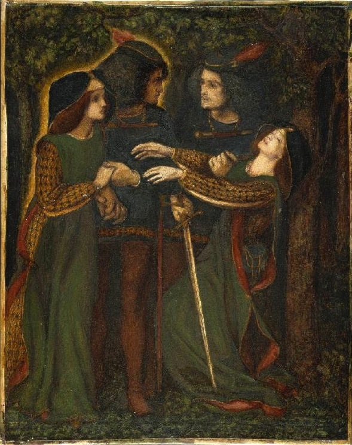

# DoppelGanger



Doppelganger takes a tutorial video of user actions with narration and transforms it into actionable steps for an Anthropic Claude Computer Use agent to follow, automating repetitive tasks like employee onboarding, data entry, and quality assurance.

This project segments the video into 15-second chunks, further divided into 1-second chunks. Whisper is used locally for accurate audio transcription, and Sonnet 3.5 handles all LLM calls. The agent summarizes 1-second segments, composes them into 15-second summaries, and finally generates an overall plan. LangChain generates a detailed XML outlining each action, executed by an Anthropic Claude Computer Use instance on your PC.

Doppelganger provides a Streamlit dashboard to upload local videos or download from YouTube.
Run the Application:
```
streamlit run app.py
```
Our demo automates a daily routine of checking AI news, where the agent learns from the video which sites to visit and the exact workflow to follow, demonstrating automated few-shot prompting and planning for computer use agents.


# Increasing Streamlit Upload Size

1. go to `~/.streamlit`
2. create a file called 'config.toml'
3. add
```
[server]
maxUploadSize = 1000
```